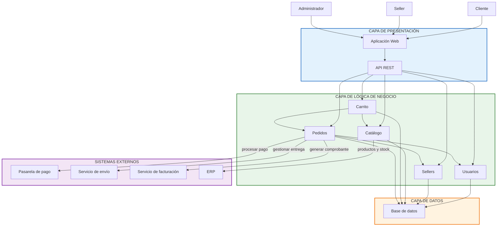

# Arquitectura inicial del sistema

## Diagrama de arquitectura

```mermaid
flowchart TD

    %% =========================
    %% ACTORES
    %% =========================

    Cliente["Cliente"]
    Seller["Seller"]
    Admin["Administrador"]


    %% =========================
    %% CAPA DE PRESENTACIÓN
    %% =========================

    subgraph PRESENTACION["CAPA DE PRESENTACIÓN"]
        Web["Aplicación Web"]
        API["API REST"]
    end


    %% =========================
    %% CAPA DE NEGOCIO
    %% =========================

    subgraph NEGOCIO["CAPA DE LÓGICA DE NEGOCIO"]
        Usuarios["Usuarios"]
        Sellers["Sellers"]
        Catalogo["Catálogo"]
        Carrito["Carrito"]
        Pedidos["Pedidos"]
    end


    %% =========================
    %% CAPA DE DATOS
    %% =========================

    subgraph DATOS["CAPA DE DATOS"]
        BD["Base de datos"]
    end


    %% =========================
    %% SISTEMAS EXTERNOS
    %% =========================

    subgraph EXTERNOS["SISTEMAS EXTERNOS"]
        Pago["Pasarela de pago"]
        Envio["Servicio de envío"]
        Facturacion["Servicio de facturación"]
        ERP["ERP"]
    end


    %% =========================
    %% ACTORES → PRESENTACIÓN
    %% =========================

    Cliente --> Web
    Seller --> Web
    Admin --> Web


    %% =========================
    %% PRESENTACIÓN
    %% =========================

    Web --> API


    %% =========================
    %% PRESENTACIÓN → NEGOCIO
    %% =========================

    API --> Usuarios
    API --> Sellers
    API --> Catalogo
    API --> Carrito
    API --> Pedidos


    %% =========================
    %% RELACIONES DE NEGOCIO
    %% =========================

    Carrito --> Catalogo
    Carrito --> Pedidos
    Pedidos --> Usuarios
    Pedidos --> Sellers


    %% =========================
    %% NEGOCIO → DATOS
    %% =========================

    Usuarios --> BD
    Sellers --> BD
    Catalogo --> BD
    Carrito --> BD
    Pedidos --> BD


    %% =========================
    %% INTEGRACIONES EXTERNAS
    %% =========================

    Catalogo -->|"productos y stock"| ERP
    Pedidos -->|"procesar pago"| Pago
    Pedidos -->|"gestionar entrega"| Envio
    Pedidos -->|"generar comprobante"| Facturacion


    %% =========================
    %% ESTILOS
    %% =========================

    style PRESENTACION fill:#e3f2fd,stroke:#1565c0,stroke-width:2px
    style NEGOCIO fill:#e8f5e9,stroke:#2e7d32,stroke-width:2px
    style DATOS fill:#fff3e0,stroke:#ef6c00,stroke-width:2px
    style EXTERNOS fill:#f3e5f5,stroke:#7b1fa2,stroke-width:2px
```
